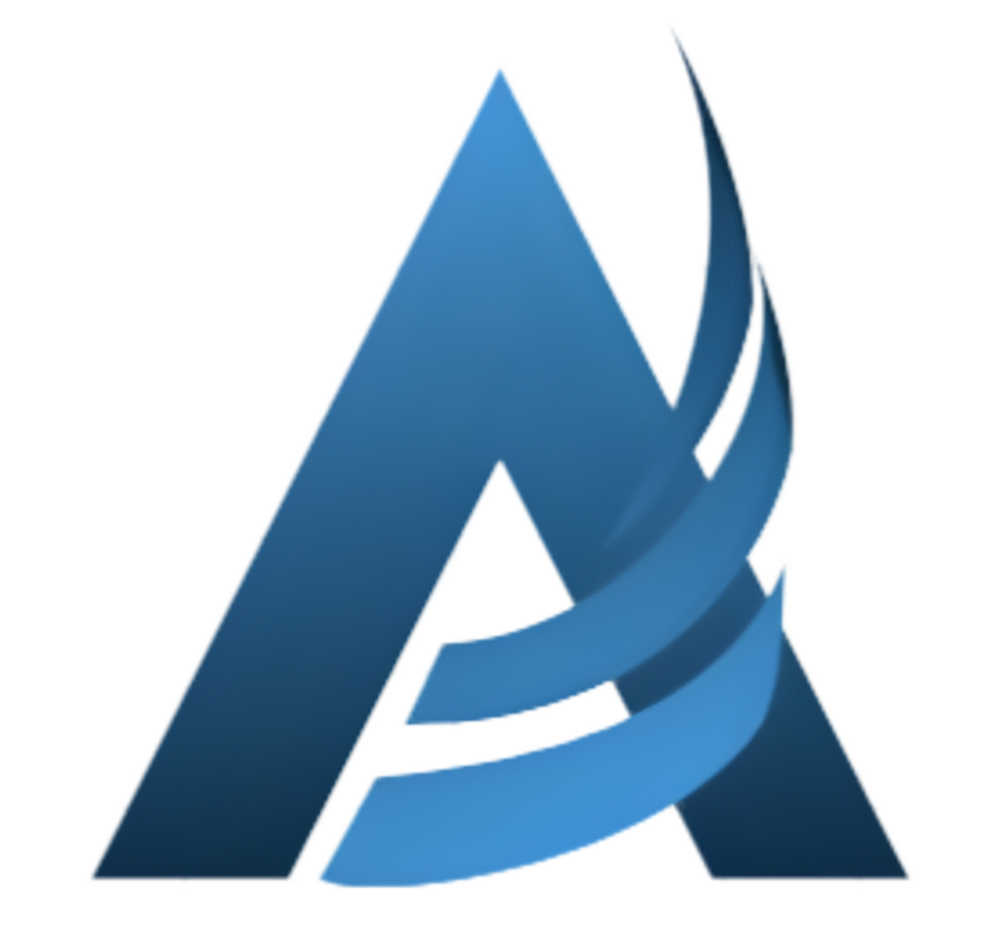

<p align="center">
  
</p>

<h1 align="center">🚀 Aswinsai Palakonda — Portfolio</h1>

<p align="center">
  <b>Full Stack Developer • No-Code Developer • AI Enthusiast</b>
</p>

<p align="center">
  <a href="https://aswinsai.vercel.app" target="_blank">
    
  </a>
  <a href="https://github.com/Aswinsaipalakonda" target="_blank">
    
  </a>
  <a href="https://www.linkedin.com/in/aswinsaipalakonda" target="_blank">
    
  </a>
</p>

<p align="center">
  
  
  
  
</p>

---

## ✨ Overview

A **modern, immersive** personal portfolio website built with cutting-edge web technologies. Features a cinematic **liquid splash screen**, an interactive **3D space background**, **smooth Lenis scrolling**, and **Framer Motion animations** — all designed to leave a lasting impression.

<p align="center">
  
</p>

## 🎬 Highlights

| Feature                     | Description                                                                 |
| --------------------------- | --------------------------------------------------------------------------- |
| 🌊 **Liquid Splash Screen** | SVG-masked text fill animation with animated waves and a percentage counter |
| 🌌 **3D Space Background**  | Interactive starfield rendered with React Three Fiber & Three.js            |
| 🧈 **Lenis Smooth Scroll**  | Buttery smooth scrolling with spring-based easing curves                    |
| 🎞️ **Framer Motion**        | Page transitions, scroll-triggered reveals, and micro-interactions          |
| 📱 **Fully Responsive**     | Pixel-perfect on mobile, tablet, and desktop                                |
| 📬 **Contact Form**         | Functional email form powered by EmailJS                                    |
| 🌍 **3D Globe**             | Rotating globe in the Contact section                                       |
| ⌨️ **TypeWriter Effect**    | Dynamic role cycling in the hero section                                    |

---

## 🛠️ Tech Stack

<p align="center">
  
</p>

| Technology                                                                                                          | Purpose                                     |
| :------------------------------------------------------------------------------------------------------------------ | :------------------------------------------ |
|                    | UI library for component-based architecture |
|      | Type-safe development                       |
|                        | Lightning-fast build tool & dev server      |
|  | Utility-first CSS framework                 |
|          | 3D graphics & space background              |
|    | Animations & page transitions               |
|                                | Smooth scrolling engine                     |
|                               | Client-side email service                   |

---

## 📂 Project Structure

```
Portfolio/
├── public/
│   └── assets/images/          # Profile photo, certificates, logos
├── src/
│   ├── components/
│   │   ├── About.tsx           # Hero section with photo & typewriter
│   │   ├── Navbar.tsx          # Fixed navigation with mobile menu
│   │   ├── Content.tsx         # Section orchestrator
│   │   ├── SplashScreen.tsx    # 🌊 Liquid fill splash animation
│   │   ├── Space.tsx           # 🌌 Three.js starfield background
│   │   ├── TypeWriter.tsx      # ⌨️ Typing animation component
│   │   ├── Languages.tsx       # Programming languages section
│   │   ├── Skills/
│   │   │   ├── Skills.tsx      # Technical skills grid
│   │   │   ├── SkillCard.tsx   # Individual skill card
│   │   │   └── SoftSkills.tsx  # Soft skills display
│   │   ├── Projects/
│   │   │   ├── Projects.tsx    # Projects showcase
│   │   │   └── ProjectCard.tsx # Project card with links
│   │   ├── Certificates/
│   │   │   ├── Certificates.tsx     # Certificates gallery
│   │   │   ├── CertificateCard.tsx  # Certificate card component
│   │   │   └── CertificateModal.tsx # Full-view modal
│   │   ├── Education/
│   │   │   ├── Education.tsx        # Timeline education section
│   │   │   └── EducationCard.tsx    # Education card component
│   │   └── Contact/
│   │       ├── Contact.tsx     # Contact section wrapper
│   │       ├── ContactForm.tsx # Email form with validation
│   │       ├── RotatingGlobe.tsx # 3D rotating globe
│   │       ├── Footer.tsx      # Social links & copyright
│   │       └── Toast.tsx       # Notification component
│   ├── providers/
│   │   └── LenisProvider.tsx   # 🧈 Smooth scroll provider
│   ├── App.tsx                 # Root app with splash screen logic
│   ├── main.tsx                # Entry point with providers
│   └── index.css               # Global styles & Lenis config
├── index.html
├── vite.config.ts
├── tailwind.config.js
├── tsconfig.json
└── package.json
```

---

## 🚀 Getting Started

### Prerequisites

- **Node.js** ≥ 18.x
- **npm** ≥ 9.x

### Installation

```bash
# 1️⃣ Clone the repository
git clone https://github.com/Aswinsaipalakonda/Portfolio.git

# 2️⃣ Navigate to the project
cd Portfolio

# 3️⃣ Install dependencies
npm install

# 4️⃣ Start the dev server
npm run dev
```

The app will be running at **`http://localhost:5173`** 🎉

### Build for Production

```bash
npm run build
npm run preview   # Preview the production build
```

---

## 📸 Sections

|  #  | Section           | Description                                                   |
| :-: | ----------------- | ------------------------------------------------------------- |
| 🌊  | **Splash Screen** | Cinematic liquid-fill name animation with wave effects        |
| 👤  | **About**         | Hero with profile photo, gradient name, and typewriter roles  |
| 🛠️  | **Skills**        | Categorized technical skills (Frontend, Backend, Tools, etc.) |
| 💻  | **Languages**     | Programming languages proficiency                             |
| 📁  | **Projects**      | Showcased projects with live demo & GitHub links              |
| 🏅  | **Certificates**  | Achievements gallery with full-view modal                     |
| 🎓  | **Education**     | Academic timeline with school details                         |
| 📬  | **Contact**       | Email form + 3D globe + social media links                    |

---

## 🎨 Design Philosophy

- **Dark Theme** with `#915EFF` purple accent color
- **Glassmorphism** effects on navigation
- **Gradient text** for headings and brand name
- **Scroll-triggered animations** using Framer Motion `whileInView`
- **3D elements** for depth and immersion
- **Inter font** for clean, modern typography
- **Custom purple scrollbar** for attention to detail

---

## 🤝 Connect with Me

<p align="center">
  <a href="https://github.com/Aswinsaipalakonda" target="_blank">
    
  </a>
  <a href="https://linkedin.com/in/aswinsaipalakonda" target="_blank">
    
  </a>
  <a href="mailto:aswinsaipalakonda@gmail.com">
    
  </a>
</p>

---

## 📜 License

This project is open source and available under the [MIT License](LICENSE).

---

<p align="center">
  <b>⭐ If you like this portfolio, give it a star!</b>
</p>

<p align="center">
  Made with 💜 by <a href="https://github.com/Aswinsaipalakonda"><b>Aswinsai Palakonda</b></a>
</p>
